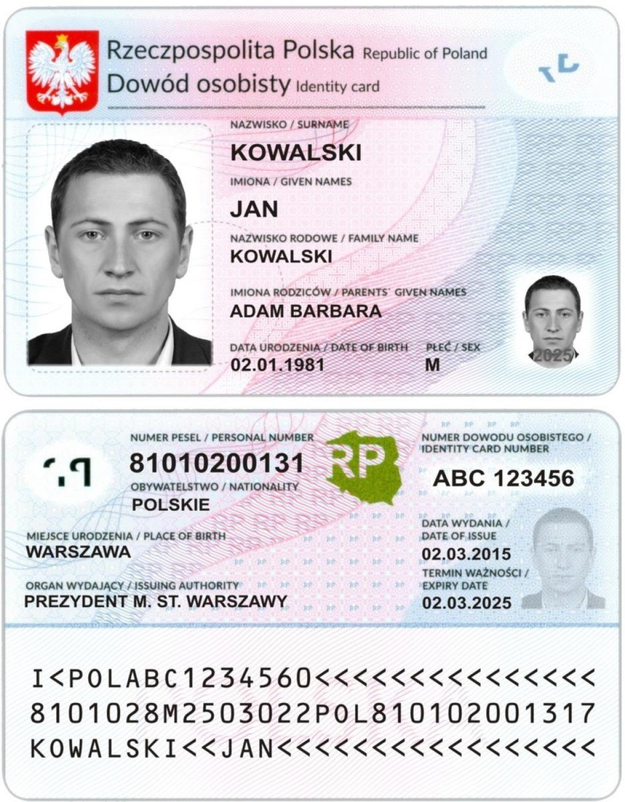

# Activepesel

[](https://badge.fury.io/rb/activepesel)
[](https://github.com/rubocop/rubocop)

A simple PESEL (polish personal ID number) validator (ActiveModel based), generator and personal data extractor.



----------

Activepesel library is available as a gem. In your Gemfile add:

```ruby
gem 'activepesel'
```

# In your model:

```ruby
class User < ActiveRecord::Base
  # you have to explicitly include it since version 0.2.0
  include Activepesel::PeselAttr

  # let's say we have dads_pesel and mums_pesel columns in the database
  # this will give the access to methods: 
  # dads_pesel_personal_data, mums_pesel_personal_data
  pesel_attr :dads_pesel, :mums_pesel

  # keep in mind that pesel validator is not performing a presence test
  # so you need another (standard) validation for this one
  validates :dads_pesel, presence: true
  validates :dads_pesel, pesel: true
  validates :mums_pesel, pesel: true
  # pesel validator returns standard rails :invalid key error message
end
```

# Activepesel::PersonalData object

When using ```attr_pesel :name_of_attr``` in your model you will get new instance method available: ```name_of_attr_personal_data```.

The method returns ```Activepesel::PersonalData``` object which has the following attributes:

```ruby
date_of_birth: Date
sex: Integer
```
See the example:

```ruby
User.find(1).dads_pesel_personal_data => Activepesel::PersonalData(...)
```


Sex attribute can take 3 values. 1 - for men, 2 - for women, 9 - not applicable ([ISO/IEC 5218](http://en.wikipedia.org/wiki/ISO/IEC_5218))

For the invalid PESEL numbers the ```date_of_birth``` attribute is set to ```nil``` and the ```sex``` is 9 - not applicable.

# Saving personal data into database

It is a common practice that you'd want to save the personal data extracted from the PESEL number to be able for example to query your records against all female persons. To do this you can do something like this:

```ruby
class User < ActiveRecord::Base
  include Activepesel::PeselAttr

  pesel_attr :pesel
  
  validates :pesel, pesel: true

  # we all don't like callbacks but for the sake of this simple example we can live with it
  before_save :set_personal_data

  private

  def set_personal_data
    self.date_of_birth = pesel_personal_data.date_of_birth
    self.sex = pesel_personal_data.sex
  end
  
end

```

# Using Activepesel outside ActiveModel / ActiveRecord models

You can use it like in the given example:

```ruby
pesel = Activepesel::Pesel.new('82060202039')
pesel.valid? => true
pesel.personal_data => Activepesel::PersonalData(...)
# or even quicker
pesel.date_of_birth => Wed, 02 Jun 1982
pesel.sex => 1
```  
# Generating PESEL numbers

Since version 0.1.0 you can generate valid PESEL numbers for a given date of birth and sex of a person.

To generate one randomly picked PESEL number for let's say a male born on November 3rd 1975:

```ruby
# picks one random number for the given personal data
Activepesel::Pesel.generate_one(sex: 1, date_of_birth: Date.new(1975,11,3))
````

To generate all (5000) PESEL numbers valid for a person of a given sex and date of birth for example a female born on May 20th 2010:

```ruby
# returns all possible numbers for the given personal data in a lexicographic order
# notice that you can pass a stringified date.
Activepesel::Pesel.generate_all, sex: 2, date_of_birth: '2010-05-20')
```

# Copyright

Copyright (c) 2012 - 2023 Wojciech Pasternak released under the MIT license


